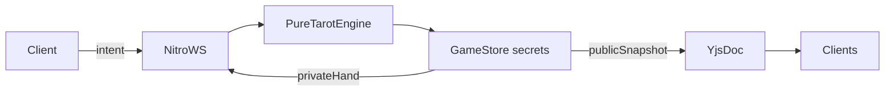
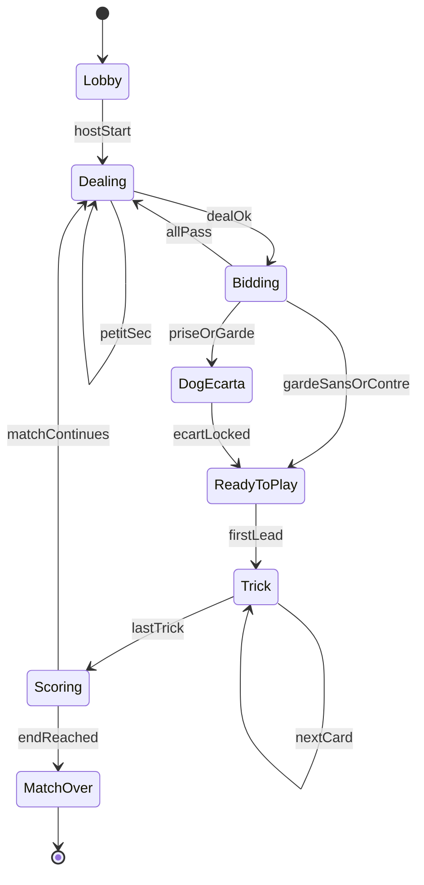

# Tarot français — moteur multijoueur (cycle 1)

**Date:** 2026-08-11  
**Status:** Draft for user review  
**Stack:** Nuxt 4 + Nitro WebSocket + Yjs + Vitest  

## Context

Le repo `cards` est aujourd’hui un **générateur / imprimeur de decks** (photos → IA → S3 → print). Il n’y a pas de jeu jouable, pas de Three.js runtime, pas de Yjs branché.

Objectif produit long terme : jeu 3D TresJS, avatars photo→Gemini→img2threejs, social amis.  
**Ce document ne couvre que le cycle 1** : fondation jouable (règles + multi + UI 2D).

Références :
- Règlement FFT (3 / 4 / 5 joueurs)
- Patterns Yjs Quizwar (`.agents/skills/yjs/SKILL.md`) — à porter, pas présent dans ce repo
- `ToCheckForDev.md` — FSM / game loop utiles surtout pour le cycle 3D ; ici la FSM = **phases de partie**
- `ExempleCards.tsx` — démo React orpheline ; référence visuelle pour un cycle 3D ultérieur, pas importée

## Goals (cycle 1)

- Partie de **Tarot français FFT complète** à **3, 4 ou 5** joueurs
- **Serveur autoritaire** (deal, mains, validation)
- Sync **publique** via Yjs ; mains **privées** via Nitro WS
- Lobby par **lien / code d’invitation** + **bots** pour sièges vides
- Fin de match : **seuil 1000 pts (défaut)** ou **N donnes** (configurable à la création)
- UI **2D** Nuxt UI jouable desktop + mobile
- Reconnexion : bot de secours sur le siège ; au retour le joueur **reprend ce siège en temps réel**

## Non-goals (cycles suivants)

| Cycle | Contenu |
|-------|---------|
| 2 | Table 3D TresJS + faces depuis decks S3 |
| 3 | Avatar photo → Gemini → img2threejs |
| 4 | Variantes **6–8** joueurs (hors FFT ; une variante documentée) |
| 5 | Amis persistants / présence sociale |

Pas dans le cycle 1 : physique Rapier, shaders, matchmaking auto, liste d’amis, React.

## Architecture



| Couche | Rôle | Emplacement |
|--------|------|-------------|
| Moteur pur | FSM + règles + scoring, déterministe, zéro I/O | `shared/tarot/` |
| Runtime serveur | Tables, bots, secrets | `server/game/` |
| Intents | Actions authentifiées | `server/routes/game/ws.ts` |
| Sync public | Phase, enchères, pli, scores, sièges | Yjs room `tarot-{code}` |
| UI | Lobby + table | `app/pages/play/` |

### Invariants

- Les clients **n’écrivent jamais** l’état de jeu dans Yjs (awareness seule : nom, siège, online, isHost).
- Mains / chien secrets : **uniquement** serveur → joueur concerné (WS).
- `version` incrémentée à chaque transition FSM réussie.
- Auth Google (`nuxt-auth-utils`) obligatoire pour créer / rejoindre. Bots = `bot:{n}`.
- Game store **in-memory** (une instance Nuxt). Redis si multi-replicas plus tard.
- Service **y-websocket** séparé ; `runtimeConfig.public.yjsWebsocketUrl`.

## State machine



Sous-états `Trick` : `awaitingPoignee` (avant 1ʳᵉ carte du joueur), `awaitingCard`, `resolvingTrick`.

### Intents

`createTable` · `join` · `addBot` · `removeBot` · `setEndMode` · `start` · `bid` · `callKing` · `discard` · `announcePoignee` · `announceChelem` · `playCard` · `leave` · `hello` (reconnexion)

API moteur : `engine.apply(state, intent, actor) → { ok, state } | { error }`.

## Data model

### Serveur (secret)

- `code`, `playerCount: 3|4|5`
- `endMode: 'threshold' | 'deals'`, `endValue` (défaut threshold 1000)
- `phase`, `version`, `dealerSeat`, `currentSeat`
- `seats[]` : `seatId`, `userId | botId`, `name`, `connected`, `controlledBy: 'human' | 'bot'`
- `hands`, `chien`, `ecart`
- `bid`, `partner` / `calledKing` (5j)
- `trick`, `piles` (attack / defense), excuse bookkeeping
- `poignees`, `chelem`, `scores`, `dealIndex`

### Public (Yjs `Y.Map('public')`)

Phase, version, seats (sans mains ; inclut `controlledBy`), historique d’enchères, contrat, chien révélé **seulement** si les règles l’autorisent, cartes du pli courant, compteurs de piles, scores, siège actif, config de fin, info match over.

### Privé (WS → un joueur)

`hand`, `legalMoves[]`, helpers d’écart / appel roi si phase concernée.

### Paramètres FFT

| N | Main | Chien | Partenariat | Poignées |
|---|------|-------|-------------|----------|
| 3 | 24 | 6 | solo vs 2 | 13 / 15 / 18 |
| 4 | 18 | 6 | solo vs 3 | 10 / 13 / 15 |
| 5 | 15 | 3 | appel au roi | 8 / 10 / 13 |

Deal : paquets de 3 (4/5j) ou 4 (3j) ; chien carte-par-carte ; interdiction 1ʳᵉ et dernière carte du paquet au chien. Petit sec → redistribuer.

## Rules coverage (cycle 1)

Complet FFT pour 3/4/5 :

- Enchères : passe, prise, garde, garde sans, garde contre (un tour, overcall strict)
- Chien / écart (contraintes rois & bouts ; atouts d’écart montrés si inévitables)
- Jeu de la carte : suivre, couper, surcouper, excuse (y compris cas dernier pli / chelem)
- Poignée, petit au bout, chelem (annoncé / non annoncé / défense)
- Marque zéro-somme (preneur ×(N−1) vs chaque défenseur ±S ; 5j : parts preneur/partenaire)
- Seuils de points selon bouts (0→56, 1→51, 2→41, 3→36)

Hors cycle 1 : pénalités tournoi / arbitre, duplicate, 6–8 joueurs.

## Sync, bots, reconnexion

### Canaux

| Canal | Contenu | Writer |
|-------|---------|--------|
| Nitro WS `/game/ws?code=` | Intents, vue privée, erreurs | Client ↔ serveur |
| Yjs `tarot-{code}` | Snapshot public + awareness | Serveur (état) ; peers (awareness) |

### Bots

- Host ajoute des bots avant `start`, ou complète les sièges vides.
- Si `currentSeat.controlledBy === 'bot'` : après délai 400–800 ms, `botPolicy(state)` choisit un intent ∈ `legalMoves`.
- Policy MVP : enchères prudentes ; jeu = carte légale semi-aléatoire biaisée. Pas d’IA club.

### Déconnexion / reclaim (temps réel)

1. Joueur drop WS → grace court (5–10 s).
2. Si toujours absent : `controlledBy = 'bot'` **sur le même siège** (pas de nouveau seat). Le bot joue à sa place.
3. Même `userId` se reconnecte + `hello` → `controlledBy = 'human'` **immédiatement**, annule le timer bot en cours, renvoie `privateView`.
4. Timeout long / abandon : host peut laisser le bot jusqu’à la fin du match.

## UI

### Routes

- `/play` — créer table (N, endMode, endValue) → redirect `/play/{code}`
- `/play/[code]` — lobby puis table selon `phase`
- Auth Google si session absente

### Lobby

Code + copier lien ; sièges humain/bot/vide ; host : bots, config fin, lancer.

### Table

- Centre : pli ; bas : main (clic seulement si légal) ; adversaires : dos + compteur + badge bot/humain
- Bandeau phase / contrat / scores / tour
- Panneaux : enchères, écart, poignée, appel roi, score de donne
- Faces MVP : placeholders CSS (catalogue arcana existant) ; images S3 au cycle 2
- `motion-v` léger sur pose de carte ; mobile : main scrollable + sheets

## Error handling

Codes : `ILLEGAL_MOVE`, `WRONG_PHASE`, `NOT_YOUR_TURN`, `TABLE_FULL`, `UNAUTHORIZED`, `UNKNOWN_TABLE`.

- Intent illégal : erreur WS, pas de bump `version`.
- Yjs public corrompu côté client : écrasé au prochain snapshot serveur.
- y-websocket down : banner « sync public dégradée » ; le serveur reste source de vérité via WS.
- Reconnect client auto + `hello`.

## Testing

Vitest (à ajouter) :

- Deal / petit sec / enchères / écart / follow-trump-excuse / scoring / poignée / chelem / petit au bout
- FSM transitions + rejets hors phase
- Bot policy toujours légale
- Reclaim human↔bot sans double siège

Smoke navigateur : create → invite → bots → une donne complète → score.

## File layout (prévu)

```
shared/tarot/           types, cards, deal, bid, play, score, fsm, botPolicy, apply
server/game/            GameStore, BotRunner, yjsPublisher, room lifecycle
server/routes/game/ws.ts
server/api/game/create.post.ts
app/pages/play/index.vue
app/pages/play/[code].vue
app/composables/useTarotGame.ts
tests/tarot/            unit tests moteur + FSM
```

## Done criteria (cycle 1)

1. Table 3/4/5, invite lien, bots, start  
2. Donne FFT complète jusqu’au score  
3. Match s’arrête à 1000 **ou** après N donnes  
4. Mains non exposées dans Yjs / aux autres clients  
5. Déco → bot ; reco → reprise du même siège en live  
6. Suite de tests moteur verte  

## Open points resolved during brainstorming

| Sujet | Décision |
|-------|----------|
| Priorité produit | Moteur + Yjs avant 3D |
| Autorité | Serveur Nuxt |
| Social MVP | Lien/code, pas d’amis persistants |
| Fin de partie | Configurable : seuil 1000 (défaut) ou N donnes (FFT n’impose pas de seuil ; 1000 = convention amicale) |
| Règles | FFT complet 3/4/5 |
| 6–8 | Cycle ultérieur, variante unique à documenter |
| Reclaim | Bot sur siège ; humain reprend en temps réel |
