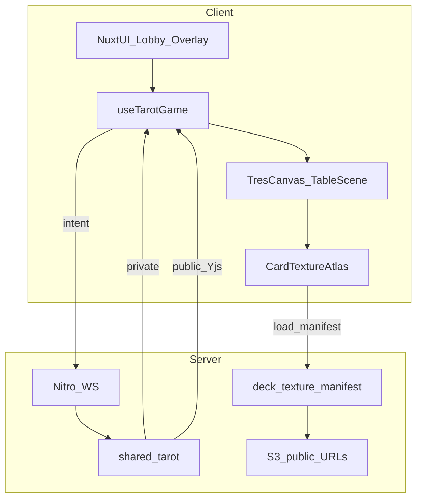

# Tarot français — table 3D TresJS (cycle 2)

**Date:** 2026-08-12  
**Status:** Draft for implementation  
**Depends on:** Cycle 1 moteur + WS + Yjs (`docs/superpowers/specs/2026-08-11-tarot-game-engine-design.md`)  
**Stack:** Nuxt 4 + TresJS (`@tresjs/nuxt` / Three r17x) + textures S3 + Vitest  

## Context

Le cycle 1 livre une partie FFT jouable en UI 2D Nuxt UI. Le produit vise une **table 3D immersive** branchée sur les **decks générés** (photos → IA → S3).

**Décisions produit (2026-08-12) :**

1. **Full 3D** sur l’écran de jeu — pas de toggle 2D/3D. La perf est une contrainte dure (mobile inclus).
2. **Faces = deck joueur** (`tarot78`, URLs S3 `finalImageUrl`) ; placeholder procédural si image absente.

Références :
- Cycle 1 : moteur `shared/tarot/`, `useTarotGame`, `/play`
- Assets deck : `DeckCard.finalImageUrl`, `settings.cardBackImageUrl` ([`app/types/deck.ts`](../../../../app/types/deck.ts))
- Export images : `GET /api/decks/:id/exports/images`
- Print specs : [`docs/print-pipeline.md`](../../print-pipeline.md) (aspect 3:4 enseignes, 9:16 atouts)
- Notes 3D : `ToCheckForDev.md` (inspirations ; **pas** de Rapier obligatoire ici)
- Démo fan cartes (React orpheline) : `ExempleCards.tsx` — patterns motion uniquement

## Goals (cycle 2)

- Remplacer la **table 2D** de `/play/[code]` par une **scène TresJS** (lobby overlay Nuxt UI conservé)
- Afficher les cartes avec **textures du deck choisi** (S3) + dos `cardBackImageUrl`
- Animer pose / ramassage / reveal de pli de façon lisible et légère
- Tenir **60 fps desktop** et **≥30 fps mobile mid** (budget perf ci-dessous)
- Réutiliser **100 %** du moteur / WS / Yjs cycle 1 (zéro duplication de règles)

## Non-goals

| Hors scope | Raison |
|------------|--------|
| Avatars photo → mesh | Cycle 3 |
| Physique Rapier / collisions | Coût perf ; cinématiques suffisent |
| Variantes 6–8 joueurs | Cycle 4 |
| Amis / matchmaking | Cycle 5 |
| Refonte règles FFT | Cycle 1 déjà livré |
| Toggle 2D permanent | Choix full 3D |
| Pack de faces CDN « défaut produit » | Uniquement placeholders locaux |

## Architecture



### Invariants

- Le **moteur reste autoritaire** ; TresJS est une **vue** de `PublicGameView` + `PrivateGameView`.
- Les clients **n’écrivent pas** l’état de jeu dans Yjs.
- Une seule scène WebGL active par onglet ; destruction complète au leave (`dispose` géométries / matériaux / textures / renderer).
- Mapping `cardCode` cycle 1 (`hearts-k`, `trump-21`, `excuse`) = `deckCards.cardCode`.

### Intégration Nuxt

- Module `@tresjs/nuxt` (client-only).
- Composant racine `ClientOnly` → `<TresCanvas>` dans la zone table.
- HUD (scores, enchères, écart, toasts, banner Yjs) reste **DOM / Nuxt UI** en overlay — pas de texte HTML dans le canvas sauf labels debug.

## Data : deck & textures

### Création de table

Étendre `POST /api/game/create` + formulaire `/play` :

| Champ | Type | Règle |
|-------|------|-------|
| `deckId` | `string` (uuid) | Obligatoire ; deck `type=tarot78` **owned** par le host |
| (existants) | playerCount, endMode, endValue | Inchangés |

Le `deckId` est stocké dans `GameState` / `PublicGameView` (public, pas secret).

### Manifest textures

Nouvel endpoint (ou extension) :

`GET /api/game/:code/deck-textures` (session + siège ou guest auth)

Réponse :

```ts
type DeckTextureManifest = {
  deckId: string
  backUrl: string | null
  cards: Array<{
    cardCode: string
    faceUrl: string | null  // finalImageUrl
    aspectRatio: '3:4' | '9:16'
  }>
}
```

- Source : jointure room → `deckId` → `deckCards` + settings back.
- Auth : tout joueur **assis** à la table (pas seulement owner) peut lire les URLs **publiques** S3 déjà exposées.
- Cartes sans `finalImageUrl` → `faceUrl: null` → placeholder côté client.

### Atlas / cache client

`useCardTextures(manifest)` :

1. Précharge back + faces présentes (concurrence limitée, ex. 6).
2. Construit un **atlas** ou un pool de `Texture` Three partagé (une texture / URL, réutilisée par N meshes).
3. Placeholders : matériau unicolore + shortLabel (canvas 256× texture générée une fois par `cardCode`).
4. `colorSpace = SRGBColorSpace` ; mipmaps on ; anisotropy ≤ 4.
5. Option perf : resize GPU max **512px** côté client (ImageBitmap) même si S3 envoie 900×1200.

## Scène 3D

### Layout

| Élément | Description |
|---------|-------------|
| Table | Disque / ovale low-poly, matériau PBR simple (1 light + env léger ou aucun IBL lourd) |
| Sièges | 3/4/5 positions angulaires ; caméra **fix-centred** (siège local en bas) |
| Main locale | Rangée / éventail de meshes devant la caméra, pick raycast |
| Centre | Zone pli (jusqu’à 5 cartes) |
| Adversaires | Stacks dos visibles + compteur DOM badge ; pas de fan complet adversaire |
| Chien | Petit tapis central quand révélé |

### Cartes

- Géométrie : **Box** très fine ou **Plane** double face (front/back materials) — **une géométrie partagée**.
- Échelle : enseignes ~ ratio 3:4 ; atouts / excuse ~ 9:16 (scale Y différent, même géométrie + UV).
- Interaction : raycaster sur main locale uniquement ; hit → `sendIntent({ type:'playCard' })` si `legalMoves`.
- Sélection écart / appel roi : mode overlay DOM **ou** highlight mesh + confirm DOM (préférer DOM pour accessibilité).

### Caméra & input

- Caméra fixe légère (leger orbit clamp optionnel desktop) — **pas** de free-fly.
- Resize : `setPixelRatio(Math.min(devicePixelRatio, quality.dprCap))`.
- Pointer events : `touch-action: none` sur canvas ; scroll page désactivé dans la zone jeu.

### Animation

- Tween (`motion-v` hors canvas **ou** `GSAP`/`maath`/`tres` hooks) : deal, play-to-trick, trick-win gather.
- Durées courtes (120–280 ms) ; **pas** de physique.
- Skip / reduce motion : `prefers-reduced-motion` → snap poses.

## Performance budget (contrainte dure)

### Qualité adaptative

Au boot, détecter et fixer un profil (non reconfigurable mid-game sauf drop fps) :

| Profil | DPR cap | Shadows | Lights | Max tex | Post |
|--------|---------|---------|--------|---------|------|
| `high` | 1.5 | soft contact optionnel | 2 | 512 | none / léger |
| `medium` | 1.25 | off | 1 | 384 | none |
| `low` | 1.0 | off | 1 | 256 | none |

Règles :

- **Pas** d’`EffectComposer` lourd (bloom/SSAO) en cycle 2.
- **Pas** de shadow maps sur mobile `low`/`medium`.
- Une seule `TresCanvas` ; `frameloop` demand-driven quand idle lobby (ou pause render hors focus).
- Object pooling : ≤ ~90 meshes cartes max réutilisés (78 + marge UI).
- `renderer.info` watchdog : si fps &lt; 25 pendant 3 s → downgrade profil une fois.

### Mobile

- Même scène full 3D (pas de fallback 2D).
- Profil `low` par défaut si `navigator.hardwareConcurrency ≤ 4` ou GPU software.
- HUD boutons plus grands ; main locale un peu plus haute.

## Mapping état jeu → scène

| `phase` | Vue 3D | Overlay DOM |
|---------|--------|-------------|
| Lobby | Table vide + sièges placeholders | SeatList, bots, invite, start |
| Bidding | Mains dos adverses ; main locale face | BidPanel |
| DogEcarta | Chien / écart | Sélection écart + callKing |
| ReadyToPlay / Trick | Pli central + main | ScoreBanner |
| Scoring | Freeze table | Deltas + Continuer |
| MatchOver | Idle | Résultat |

`privateState.hand` → meshes face-up locaux.  
`publicState.trick` → meshes centre.  
`handCounts` → stacks adverses.

## File layout (prévu)

```
app/components/play/tres/
  TableScene.vue          # TresCanvas root
  TableFelt.vue
  CardMesh.vue            # instance visuelle
  HandFan.vue
  TrickPile.vue
  SeatAnchor.vue
app/composables/
  useCardTextures.ts
  usePlayQuality.ts
  useTarotGame.ts         # inchangé contrat ; déjà livré
app/pages/play/
  index.vue               # + sélecteur deckId
  [code].vue              # TableScene remplace TrickArea/HandCards table
server/api/game/
  create.post.ts          # + deckId zod
  [code]/deck-textures.get.ts
shared/tarot/types.ts     # + deckId? sur GameState / PublicGameView
tests/
  play/textureManifest.test.ts
  # smoke perf manuel documenté
```

Composants 2D `HandCards` / `TrickArea` / `CardFace` : **retirés de la table** (conservés évent. pour stories / fallback tests unitaires hors runtime).

## Error handling

| Cas | Comportement |
|-----|--------------|
| Deck manquant / pas tarot78 | 400 à la create |
| Texture 404 | Placeholder + log once |
| WebGL context lost | Banner « Rechargez » + `canvas` recreate |
| Yjs down | Banner cycle 1 inchangée ; scène suit WS |
| Deck sans aucune face | Partie jouable 100 % placeholders |

## Testing

- Vitest : manifest mapping `cardCode` ↔ urls ; create rejet deck invalide.
- Manuel : host deck partiel → placeholders ; deal + play 1 donne 4j bots ; Chrome mobile throttling 4× CPU.
- Checklist perf : `renderer.info.memory.textures`, fps overlay debug (`?debugGfx=1`).

## Done criteria (cycle 2)

1. `/play` demande un deck `tarot78` owned ; table stocke `deckId`
2. Scène TresJS full-screen zone table ; plus de grille 2D de jeu
3. Faces S3 + dos ; placeholders si manquant
4. Intent play / bid / discard / continue toujours via cycle 1
5. Profils `high|medium|low` appliqués ; downgrade auto si fps bas
6. Dispose propre ; pas de fuite textures après 3 parties
7. Smoke 1 donne host+bots OK desktop + un mobile réel ou DevTools

## Open points resolved

| Sujet | Décision |
|-------|----------|
| 2D vs 3D | Full 3D optimisé |
| Source faces | Deck host S3 (`finalImageUrl`) + placeholders |
| Physique | Non (cinématique) |
| HUD | DOM overlay Nuxt UI |
| Atlas | Pool textures + resize client ≤512 |

## Next after cycle 2

1. Cycle 3 — avatars  
2. Polish gfx (envmap légère, felt detail) sans casser le budget  
3. Plan d’implémentation détaillé : [`docs/superpowers/plans/2026-08-12-tarot-table-3d.md`](../plans/2026-08-12-tarot-table-3d.md) — **ready**
